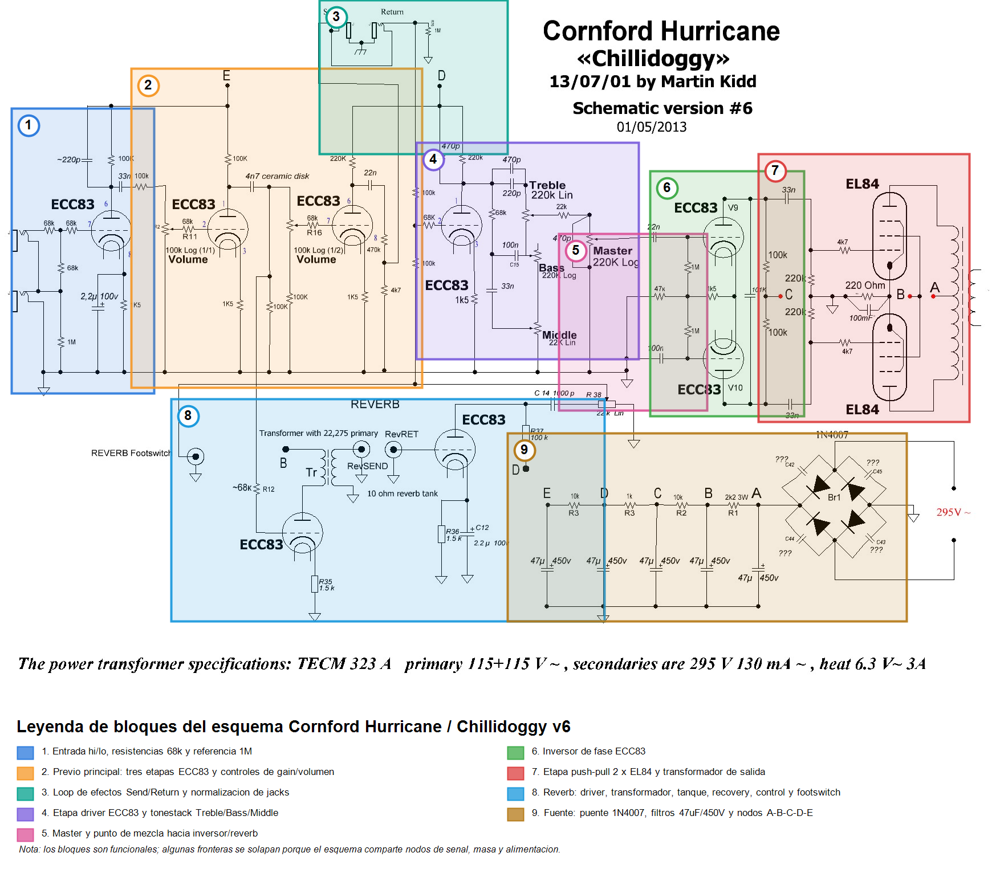
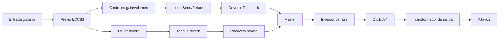
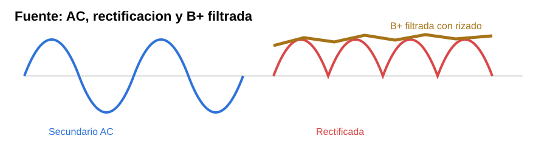
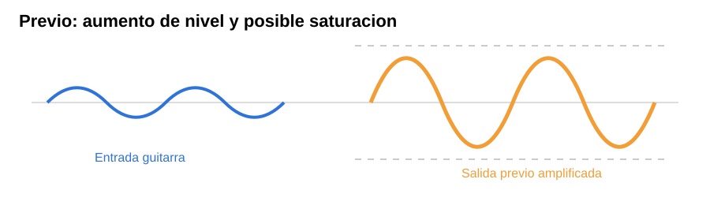
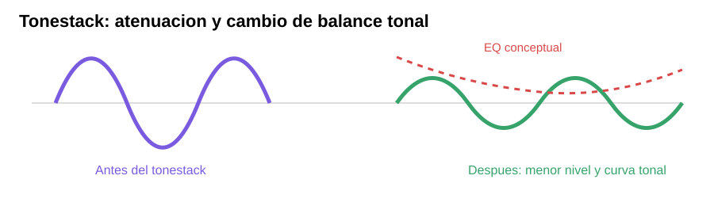
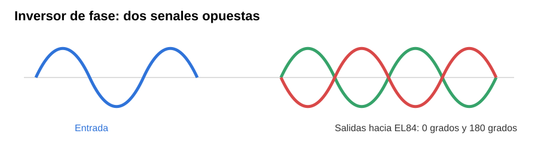
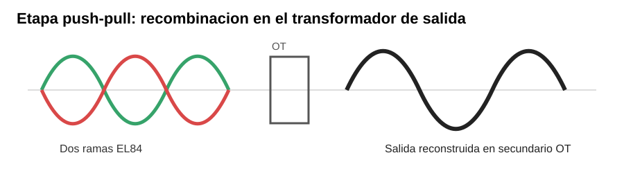

# Memoria del proyecto - Reconstruccion Cornford Hurricane DIY

## 1. Objetivo

El objetivo de este proyecto es reconstruir un amplificador de guitarra a valvulas basado en el Cornford Hurricane / "Chillidoggy", verificando tanto la teoria como la implementacion fisica.

No se busca solo que el amplificador encienda o produzca sonido. El objetivo es que sea:

- Seguro.
- Estable.
- Fiel al caracter del circuito objetivo.
- Silencioso en cuanto a hum/ruido/oscilaciones.
- Correctamente documentado.
- Facil de mantener y diagnosticar en el futuro.

## 2. Documentacion base

Referencia principal:

- `Hurricane/CONFIRMED_Hurricane_Chillidoggy_schematic_v6_2013-05-01.jpg`

Layout principal:

- `Hurricane/Hurricane_Chillidoggy_layout_v6_2013-04-26.gif`

Transcripcion del esquema:

- `TRANSCRIPCION_COMPLETA_ESQUEMA_HURRICANE.md`

Mapa de bloques:

## 3. Vista general del amplificador

El amplificador es un circuito completo a valvulas con:

- Entrada de guitarra.
- Varias etapas de previo con ECC83 / 12AX7.
- Loop de efectos.
- Tonestack Treble/Bass/Middle.
- Control Master.
- Inversor de fase.
- Etapa de potencia push-pull con 2 x EL84.
- Transformador de salida.
- Reverb con transformador driver, tanque y recovery.
- Fuente de alta tension con nodos `A`, `B`, `C`, `D`, `E`.

Flujo general de senal:

## 4. Fuente de alimentacion

Funcion:

- Convertir la alta tension AC del transformador en B+ DC.
- Filtrar esa tension.
- Distribuirla por nodos `A`, `B`, `C`, `D`, `E`.

Nodos:

| Nodo | Funcion principal |
|---|---|
| `A` | Placas EL84 mediante transformador de salida |
| `B` | Pantallas EL84 y driver de reverb |
| `C` | Inversor de fase |
| `D` | Etapas de previo/reverb intermedias |
| `E` | Primeras etapas de previo |

Efecto en la senal:

- Una fuente con mala filtracion introduce hum.
- Tensiones demasiado altas cambian headroom, disipacion y tacto.
- Tensiones demasiado bajas reducen potencia, headroom y pueden cambiar la compresion.
- La cadena `A-B-C-D-E` desacopla etapas para evitar realimentaciones indeseadas por la alimentacion.

Problema detectado:

- El transformador real fotografiado entrega 325 V AC, no 295 V AC.
- Esto puede elevar la B+ sin carga hasta unos 460 V DC.
- Ver `ANALISIS_TRAFO_ALIMENTACION_325V.md`.

Forma de onda esperada:

## 5. Entrada y primeras etapas de previo

Funcion:

- Adaptar la guitarra al amplificador.
- Definir impedancia de entrada.
- Elevar la senal desde nivel de instrumento.
- Moldear el contenido armonico inicial.

Componentes clave:

- Resistencias de entrada de 68k.
- Referencia de entrada de 1M.
- Etapas ECC83 con resistencias de placa y catodo.
- Condensadores de acoplo entre etapas.

Efecto en la senal:

- La primera etapa condiciona ruido, sensibilidad y respuesta tactil.
- Los condensadores de catodo y acoplo afectan graves y ganancia.
- Los controles de gain/volumen determinan cuanto se empujan las etapas posteriores.

Forma de onda conceptual:

## 6. Loop de efectos

Funcion:

- Permitir insertar efectos entre previo y etapas posteriores.
- Normalizar la senal cuando no hay cables conectados.

Efecto en la senal:

- Un loop mal cableado puede dejar el ampli mudo.
- Contactos sucios o mal normalizados pueden introducir cortes, ruido o perdida de nivel.
- Es un punto importante de diagnostico si hay senal antes pero no despues.

## 7. Tonestack

Funcion:

- Ecualizar pasivamente la senal mediante Treble, Bass y Middle.

Efecto en la senal:

- Atenua parte importante de la senal.
- Cambia la curva de medios y la sensacion de brillo/cuerpo.
- Interactua con la impedancia de la etapa anterior y el Master posterior.

Forma de onda conceptual:

## 8. Master y mezcla de reverb

Funcion:

- Ajustar nivel que llega al inversor de fase.
- Recibir o mezclar la senal recuperada de reverb segun la topologia exacta.

Efecto en la senal:

- Controla cuanta senal llega a la etapa de potencia.
- Permite saturar previo manteniendo potencia mas contenida.
- Su ubicacion afecta como se percibe la reverb y la saturacion.

## 9. Inversor de fase

Funcion:

- Convertir una senal en dos senales opuestas.
- Excitar las dos EL84 en configuracion push-pull.

Efecto en la senal:

- Determina simetria, headroom y caracter de saturacion antes de potencia.
- Si esta mal cableado, puede haber poca potencia, distorsion rara u oscilacion.
- Sus condensadores de acoplo y resistencias de reja condicionan la respuesta de graves hacia la etapa EL84.

Forma de onda conceptual:

## 10. Etapa de potencia 2 x EL84

Funcion:

- Amplificar corriente y tension suficientes para excitar el transformador de salida.
- Entregar potencia al altavoz.

Transformador real:

- Hammond 1750H.
- Primario 6600 ohm C.T.
- Secundario 8 ohm.
- 20 W.

Efecto en la senal:

- Las EL84 aportan compresion, saturacion y respuesta dinamica caracteristica.
- El bias por catodo afecta disipacion, headroom y sensacion de ataque.
- El transformador de salida afecta graves, agudos, compresion y saturacion magnetica.

Forma de onda conceptual:

## 11. Reverb

Funcion:

- Tomar parte de la senal seca.
- Excitar un tanque de reverb mediante un transformador.
- Recuperar la senal reverberada.
- Mezclarla con la senal principal.

Transformador real:

- Hammond 1750A.
- Primario 22,8k.
- Secundario 8 ohm.

Efecto en la senal:

- Anade ambiente y profundidad.
- El driver y recovery condicionan ruido, brillo y cantidad de reverb.
- El cableado de masas de reverb es critico para evitar hum.

## 12. Salida y altavoz

Funcion:

- Adaptar la alta impedancia de las EL84 a la baja impedancia del altavoz.

Regla critica:

- No encender con EL84 instaladas sin altavoz o carga ficticia adecuada.

Efecto en la senal:

- La impedancia del altavoz afecta potencia, respuesta en frecuencia y comportamiento del transformador.
- Una mala conexion puede danar el transformador de salida o las valvulas.

## 13. Pendientes de reconstruccion

La lista viva de piezas, fallos y cambios esta en:

- `PENDIENTES_RECONSTRUCCION_HURRICANE.md`

## 14. Proximos capitulos de la memoria

Pendiente desarrollar:

- Calculos de tensiones esperadas.
- Calculo de corriente y disipacion de EL84.
- Comparacion de transformadores de alimentacion.
- Tabla de componentes premium recomendados.
- Guia de cableado por bloques.
- Procedimiento de primera puesta en marcha.
- Registro de mediciones reales.

